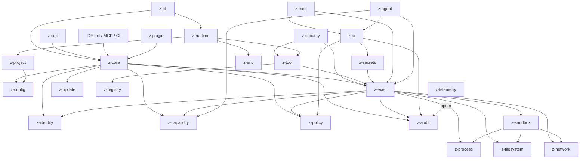
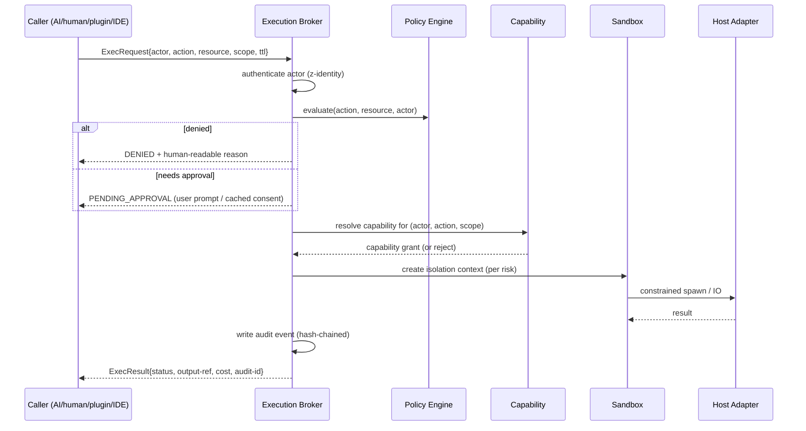

# 03 — SYSTEM ARCHITECTURE

## Layers

```
L1 ZENTRION CORE      host detection, lifecycle, IPC, config, identity,
                      capability+policy interfaces, process/fs/net abstraction,
                      secure-storage interface, logging, audit, errors
L2 DEVELOPER RUNTIME  projects, environments, language runtimes, deps, tools,
                      manifests, reproducibility
L3 SECURITY RUNTIME   policy engine, sandbox adapters, restrictions, secrets,
                      audit, threat detection, scanning orchestration
L4 AI RUNTIME         provider/model abstraction, AI gateway, local AI,
                      routing, context, tool-calling, AI policy/security
L5 AGENT RUNTIME      agent identity/lifecycle, planning loop, approvals,
                      resource limits, termination
L6 ECOSYSTEM          SDK, registry client, plugin system, tool/agent/MCP/model registries
L7 CLOUD/ENTERPRISE   accounts, teams, fleet, central policy/audit — FUTURE, Phase 5+
```

Dependency direction is strictly downward. L7 is optional and *never* in the
request path of L1–L5.

## Component inventory (26 core components)

| Component | Layer | Exists in core? | Cloud? | Why it exists |
|---|---|---|---|---|
| z-core | 1 | yes | no | lifecycle, IPC, error model, plugin host API |
| z-config | 1 | yes | no | layered config resolution |
| z-identity | 1 | yes | no | who is calling (user/agent/plugin/mcp/ci) |
| z-capability | 1 | yes | no | grant/check/revoke/expiry of capabilities |
| z-policy | 1 | yes | no | declarative rules + evaluation engine |
| z-exec (broker) | 1 | yes | no | single choke point for host effects |
| z-process | 1 | yes | no | spawn/kill/inspect abstraction |
| z-filesystem | 1 | yes | no | path/permission abstraction, VFS scoping |
| z-network | 1 | yes | no | connect/listen policy enforcement |
| z-sandbox | 1/3 | yes | no | per-OS isolation adapters |
| z-secrets | 1/3 | yes | no | OS-keystore-backed secret store |
| z-audit | 1/3 | yes | no | hash-chained event log |
| z-telemetry | 1 | opt-in only | no | explicitly disabled by default |
| z-cli | UI | yes | no | the terminal UX |
| z-runtime | 2 | yes | no | projects/environments/tools lifecycle |
| z-project | 2 | yes | no | `.zentrion/` manifest management |
| z-env | 2 | yes | no | environment profiles |
| z-tool | 2 | yes | no | tool install/verify/inventory |
| z-registry | 6 | yes (client) | registry is remote | verified package fetch |
| z-plugin | 6 | yes | no | manifest+permission-gated plugins |
| z-update | 1 | yes | downloads from CDN | signed self-update |
| z-ai | 4 | yes | providers optional | provider/model abstraction + gateway |
| z-agent | 5 | yes | no | agent runtime |
| z-mcp | 4/6 | yes | servers are local/remote | MCP gateway |
| z-security | 3 | yes | no | scanner orchestration (delegates to tools) |
| z-sdk | 6 | later | no | language SDKs (Phase 4) |

## Dependency graph (DAG, no cycles)



**Cycle prevention rule:** components may import *downward only*; any new
dependency that would close a loop must go through an interface defined in
z-core (dependency inversion).

## Execution flow (the one true path)



Humans and AI use the same broker; only the **actor type** and default
approval thresholds differ.

## Monorepo layout (proposal — materialized in Phase 1)

```
zentrion/
├── core/            z-core, z-config, identity, errors, IPC
├── policy/          policy engine + language + conformance suite
├── capability/
├── exec/            execution broker
├── sandbox/         per-OS adapters
├── host/            fs/net/process host adapters
├── secrets/
├── audit/
├── registry/        registry client + manifest schemas
├── tools/           tool manager
├── plugins/
├── ai/              provider adapters, gateway, local AI
├── agents/
├── mcp/
├── projects/        .zentrion scaffolding
├── environments/
├── cli/             z binary, commands
├── sdk/
├── schemas/         JSON Schemas (single source of truth)
├── docs/
├── tests/           integration, conformance, chaos
└── infrastructure/  CI, release signing, packaging
```

## MVP cut for Phase 1 (required-for-v1 filter)

**Required for V1:** z-core, config, identity, capability, policy, broker,
process/fs/network adapters, secrets, audit, CLI (read-only safe commands),
tool manager with verification, project scaffolding, policy engine, sandbox
(Linux first), AI provider abstraction, agent runtime basic loop, update
verification.

**Later:** plugins, marketplace, registry *server*, MCP gateway, local AI
adapters, SDK languages beyond TS+Python, scanner orchestration.

**Optional:** telemetry (off), cloud sync, IDE extensions.

**Future research:** OS-level attestation, kernel-enforced policy, NPU routing.

See `35-ROADMAP.md` for phase mapping.
