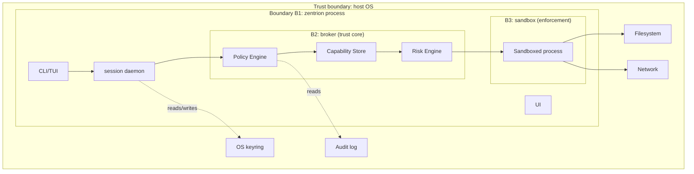

# 06 — SECURITY ARCHITECTURE

## 6.1 Threat model (see also `07-THREAT-MODEL.md`)

Primary adversaries:
1. **Prompt-injected model** — malicious content in files/web/issue text steers an agent. Core defense: capability + policy enforcement outside the model.
2. **Malicious tool/plugin/MCP package** — supply chain. Defense: signatures, checksums, provenance, permission manifests, quarantine-first run.
3. **Malicious human** — user trying to exfiltrate employer data. Defense: enterprise policy overrides, central audit, lockdown.
4. **Local attacker** — another process on the machine. Defense: named-pipe ACLs, encrypted secrets, no privileged daemon.
5. **Remote attacker on network path** — Defense: TLS pinned for registry/updates, no inbound listeners.
6. **Compromised registry/cloud** — Defense: signatures made by publishers, not registry; client verifies independently.

Explicit non-goals: protection against kernel compromise; protection against a fully-rooted host adversary.

## 6.2 Defense in depth — layers

```
L0  OS platform controls      (users, ACLs, sandbox primitives, keyring)
L1  Process identity          (every request carries authenticated identity)
L2  Policy engine             (deny-by-default declarative rules)
L3  Capability tokens         (scoped, expiring, revocable)
L4  Risk engine + approvals   (human consent for HIGH/CRITICAL)
L5  Sandbox (platform-native) (enforced isolation at execution time)
L6  Audit hash chain          (tamper-evident local trail)
L7  Optional central policy   (enterprise overrides local)
```

Rule: **security decisions are enforced by code, not by prompts.** Prompts only
*add* consent on top of technical checks.

## 6.3 Fail-closed rules
- No valid policy file → default secure policy (workspace read/write only, no net, no secrets).
- Policy parse error → refuse affected operations (exit 2), never fall back to permissive.
- Sandbox unavailable at required level → operation blocked with a clear message + documented `--allow-unsandboxed` escape hatch (see §6.6).
- Capability expired or revoked → deny immediately, even mid-session.

## 6.4 Security boundaries (Mermaid)



Boundaries:
- **B1**: only zentrion processes may talk to the daemon (named pipe with ACL / unix socket 0600). Peers must present an origin token (CLI, UI, MCP bridge).
- **B2**: broker is the only code that reads/writes capability tokens and audit chain. No other component may grant capabilities.
- **B3**: sandboxed processes have no access to the daemon pipe, no secrets env, no zentrion config.

## 6.5 Security error UX

Every block follows:

```
✗ <plain-language what was blocked>
  Attempted:  <action + resource>
  Reason:     <rule/policy/capability state>
  Policy:     <which policy file, which rule>
  Risk:       <level>
  Options:    (1)… (2)… (3) cancel
  Audit:      <event id>
```

Never expose raw error codes as primary message; raw code goes in a detail line
for debugging.

## 6.6 Emergency / escape hatches
- `z lockdown` — instant kill-switch (see 09 for detail).
- `--allow-unsandboxed` — requires typed confirmation (`I understand`), logged as CRITICAL event, only when user identity (never agent identity) requests it. Enterprise policy can hard-disable this flag.
- `z capability repair` — a separately-prompted administrative flow for when policy files are corrupted; requires local user confirmation, writes audit events, never silently restores permissive state.

## 6.7 Secret handling rules
- Secrets live in OS keyring; only opaque handles enter process memory of tools.
- Secret values are redacted in all logs, audit entries, error messages, and AI context by a hard-coded scrubber (pattern + handle registry). Scrubbing cannot be disabled by policy or config.

## 6.8 Anti-malware / trust requirements for distribution
- Signed releases (minisign/ed25519), published checksums.
- `z install` verifies checksum + signature before unpacking; mismatch = hard fail.
- New tools run in quarantine profile on first run (reduced caps, mandatory logging) until user confirms.
- No claim that these mechanisms make malware impossible — they raise cost and provide detection/rollback.

## 6.9 Security checklist (per feature)
Every new feature must answer: identity? capability? policy default? risk level?
sandbox need? audit event? secret exposure? failure mode when enforcement fails?
