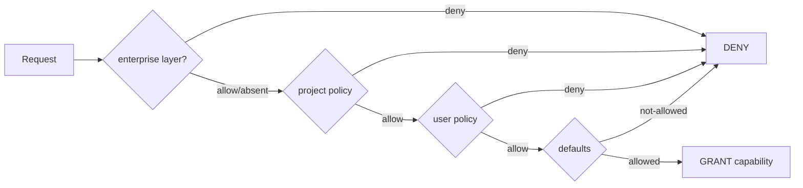

# 09 — POLICY SPEC

## 9.1 Language

Declarative YAML, versioned.

```yaml
apiVersion: zentrion.policy/v1
kind: Policy
metadata:
  name: my-agent-policy
  description: refactoring agent in this repo

defaults:
  mode: deny        # deny-by-default; only explicit allow grants

filesystem:
  read:
    - "./src/**"
    - "./tests/**"
  write:
    - "./src/**"
  delete: []        # empty = deny

network:
  allow:            # allowlist of host:port / cidr
    - "api.example.com:443"
  listen: []        # empty = deny

secrets:
  read: false
  write: false

system:
  admin: false

process:
  spawn:
    - "name:python"
    - "name:npm"

ai:
  models:
    allow:
      - "provider:openai/model:gpt-4o-mini"
  send_secrets: false
  max_tokens_per_day: 200000

agents:
  - name: refactor-agent
    capabilities:
      filesystem:
        read: ["./src/**", "./tests/**"]
        write: ["./src/**"]
      network:
        allow: []
      secrets:
        read: false
      system:
        admin: false
    resources:
      cpu: 30%
      memory: 2GB
      runtime: 10m
      network: restricted
```

## 9.2 Semantics
- `defaults.mode: deny` — everything not explicitly allowed is denied.
- Lists of paths/hosts are **allowlists**, not cumulative across layers (see precedence).
- Unknown keys → policy validation error (strict parsing; prevents typos opening holes).
- Conflicts inside one document → most restrictive wins (deny beats allow).

## 9.3 Precedence & inheritance (lowest → highest)

1. **built-in default** (deny-all except: read/write in cwd workspace, spawn nothing, net nothing, secrets nothing)
2. **user** (`~/.zentrion/policy.yaml`)
3. **project** (`.zentrion/policy.yaml`)
4. **enterprise / lockdown overlay** (future; highest, can only *restrict*)

Merging rule: effective scope for a domain = **intersection** of the more
permissive lower layer with the higher layer when the higher layer specifies
that domain; if a higher layer *omits* a domain, lower layer's value stands.
This guarantees layering can only narrow, never widen. Exception: `--approve`
consent can grant a *temporary* capability outside policy, but it is logged as
an explicit user-consent event, time-boxed, and cannot exceed CRITICAL
constraints without typed confirmation.



## 9.4 Validation
`z policy validate` — schema check (JSON Schema, strict), path sanity
(absolute-path flagging), host format, model refs, agent definitions. Invalid
policy = hard error; runtime refuses to start affected scope.

`z policy test --request '...'` — dry-run evaluation for authoring.

## 9.5 Emergency / lockdown overlay
`z lockdown` writes a temporary overlay policy (highest precedence, TTL-bound)
that denies everything except local read-only + `z lockdown --off`. It
additionally revokes live capabilities and kills agents. Overlay expiry restores
previous state automatically; the event is audited.
